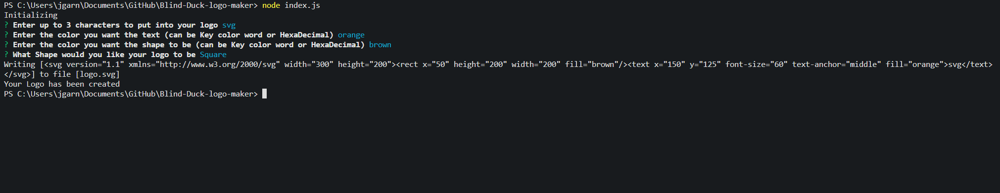
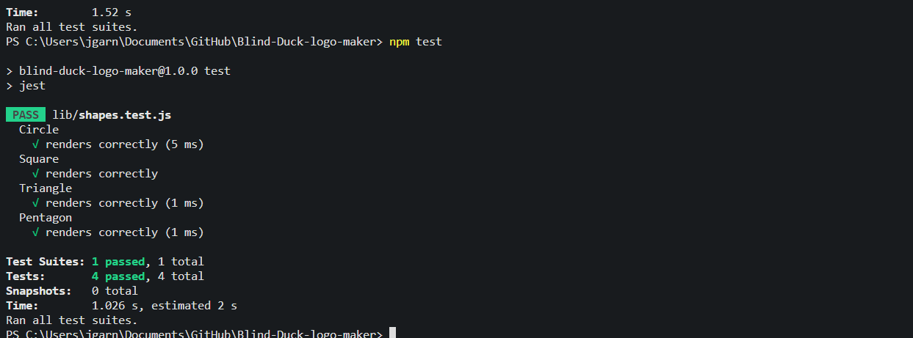

# Blind Duck Logo Creator

## Description

This is an app that will create a svg logo for you with a few prompts

## Table of Contents (Optional)

If your README is long, add a table of contents to make it easy for users to find what they need.

- [Installation](#installation)
- [Usage](#usage)

## Installation

to install open an integrated terminal and type 'npm init -y' then type 'npm i'

## Usage

once the package is installed you will be prompted to stylize your logo. after answering the questions an svg file will be created

## Links

here is a link to the repository on GIThub
https://github.com/Jgarnaat/Blind-Duck-logo-maker

## Test

to run the test, after you have installed the packages type 'npm test' to start the test
if it was installed and ran correctly you should see 4 passed tests
 
  